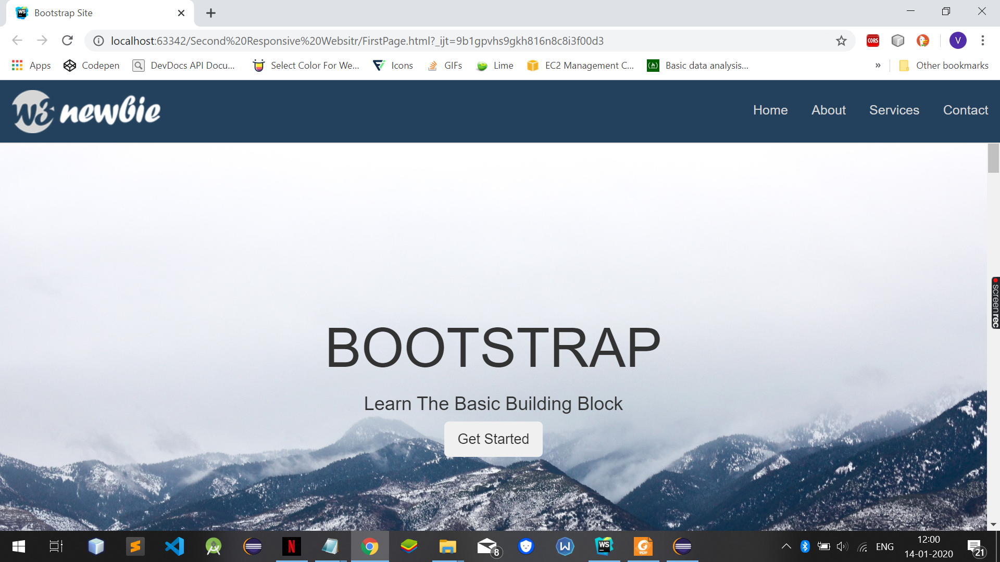
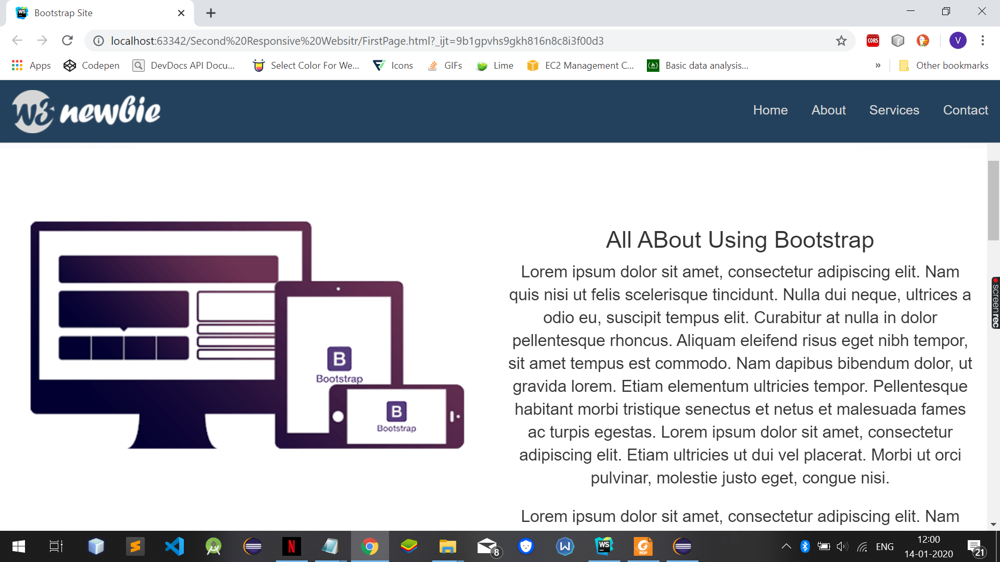
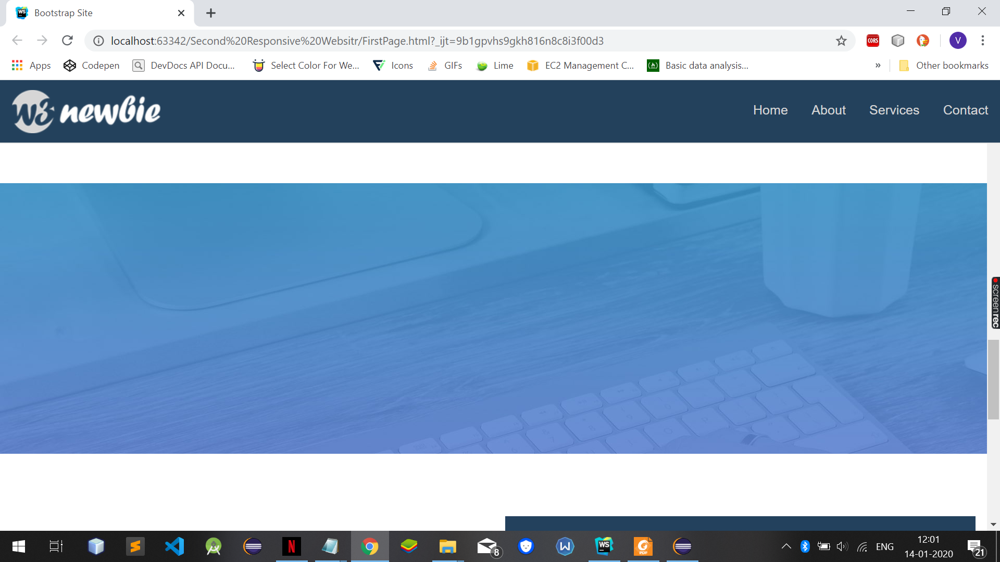
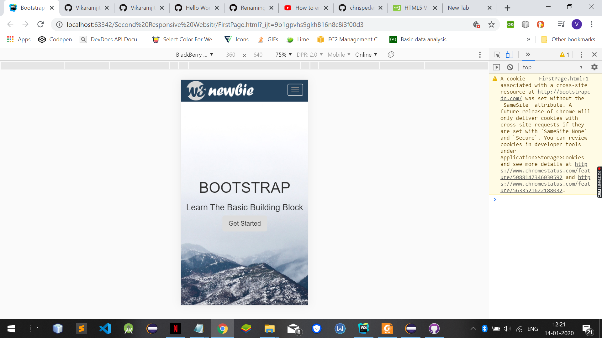

# Responsive-Web-Pages

This is a simple responsive web page created using HTML5, CSS3 and Bootstrap4. The images depicting how the project looks like 
have been embedded here:-

<<<<<<< HEAD
###Video Showing The Page:-
<video width="320" height="240" controls>
  <source src="Video/video.mp4" type="video/mp4">
</video>
=======
### Images:-

#### The images used were provided in the online course that I joined, through which I learned all this.
>>>>>>> 97f8612c81d8f358a6daab47345a7091ad432335
